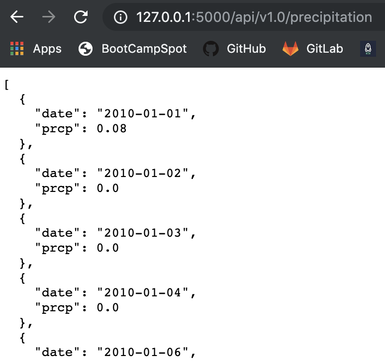
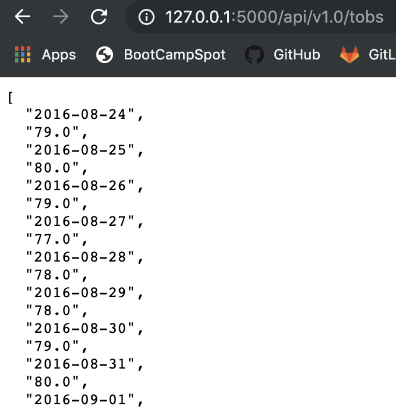

# SurfsUp-SQLAlchemy

SQL Methods introduced in my previous repository are combined with Advanced Python techniques to analyze climate trends. 
--------------------------------------------------------------------------------
Below are images as previews for the analysis:
--------------------------------------------------------------------------------

--------------------------------------------------------------------------------

--------------------------------------------------------------------------------

--------------------------------------------------------------------------------

--------------------------------------------------------------------------------

--------------------------------------------------------------------------------

--------------------------------------------------------------------------------

--------------------------------------------------------------------------------
