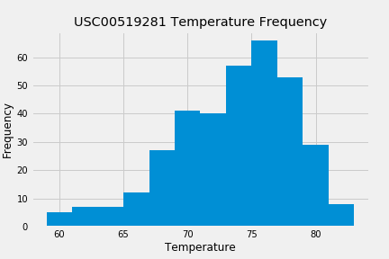

# SurfsUp-SQLAlchemy
--------------------------------------------------------------------------------
Below are images as previews for the analysis:
--------------------------------------------------------------------------------

--------------------------------------------------------------------------------

--------------------------------------------------------------------------------

--------------------------------------------------------------------------------
